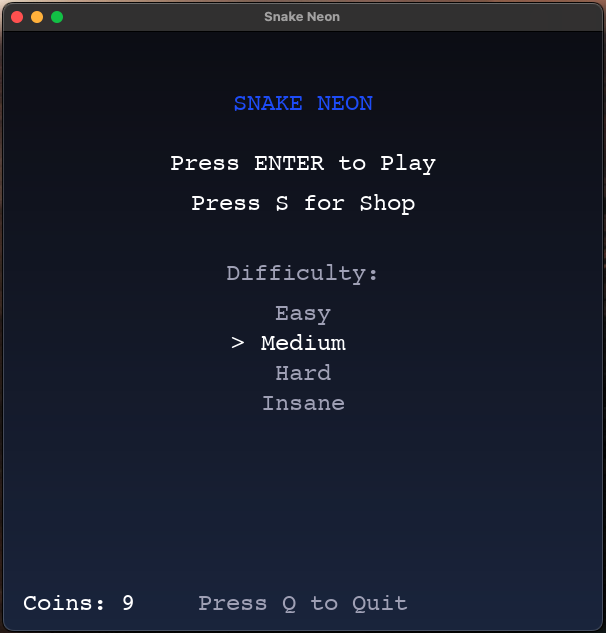

# 🐍 Snake Neon  
A fast, modern, neon-themed Snake game built in Python + Pygame — featuring skins, shop system, special food, particles, difficulty modes, and a clean modular architecture.

  

---

## 🎮 Features

### Neon Aesthetic
- Gradient background  
- Glowing grid  
- Neon food animations  
- Smooth neon particles on every eat  

### Gameplay
- Classic snake movement with modern smoothness  
- WASD + Arrow key support  
- Difficulty modes: **Easy, Medium, Hard, Insane**  
- Speed increases with your score  
- Obstacle generation per difficulty  

### Shop System
- Unlockable Snake Skins:
  - Green (default)
  - Cyan
  - Pink  
- Double Coins Boost  
- Persistent data saved locally (coins, skins, high scores)

### Special Food
- Appears every 20 seconds  
- Rainbow animated  
- +3 score / +3–5 coins  
- Lasts for 3 seconds  

### Save System
- Coins  
- High Score  
- Owned skins  
- Equipped skin  

### Modular Code Structure
All code is separated into clean modules:
- `game.py`  
- `snake.py`  
- `food.py`  
- `shop.py`  
- `obstacles.py`  
- `particles.py`  
- `theme.py`  
- `settings.py`  
- `main.py`  

This keeps the project easy to expand, debug, and maintain.

---

## Controls

| Key | Action |
|-----|--------|
| ↑ / W | Move Up |
| ↓ / S | Move Down |
| ← / A | Move Left |
| → / D | Move Right |
| R | Restart after game over |
| S | Open Shop (from main menu) |
| ESC | Back (Shop → Menu) |

---

